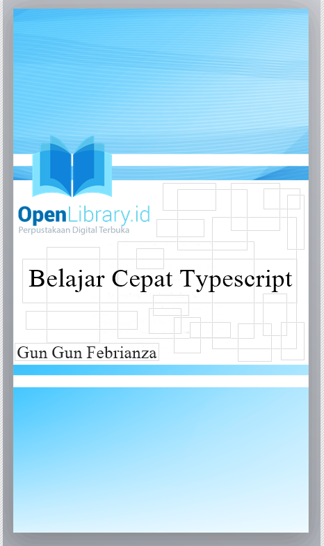

<h1>Welcome,</h1>

This repository has been written to introduce you into the typescript programming language and cover entire typescript capabilities.

<h2>So, What is Typescript?</h2>

First, TypeScript is an <strong>open source programming language</strong> maintained by Microsoft. TypeScript is a superset of JavaScript, 
the meaning of superset refer to 'javascript with new capabilities'. All existing javascript program are also valid typescript program.

TypeScript is a language for application-scale JavaScript. TypeScript adds optional types, classes, and modules to JavaScript. 
ypeScript supports tools for large-scale JavaScript applications for any browser, for any host, on any OS. 
TypeScript compiles to readable, standards-based JavaScript.

----------------
MIT License

Copyright (c) 2016 Gun Gun Febrianza

Permission is hereby granted, free of charge, to any person obtaining a copy of this software and associated documentation files (the "Software"), to deal in the Software without restriction, including without limitation the rights to use, copy, modify, merge, publish, distribute, sublicense, and/or sell copies of the Software, and to permit persons to whom the Software is furnished to do so, subject to the following conditions:

The above copyright notice and this permission notice shall be included in all copies or substantial portions of the Software.

THE SOFTWARE IS PROVIDED "AS IS", WITHOUT WARRANTY OF ANY KIND, EXPRESS OR IMPLIED, INCLUDING BUT NOT LIMITED TO THE WARRANTIES OF MERCHANTABILITY, FITNESS FOR A PARTICULAR PURPOSE AND NONINFRINGEMENT. IN NO EVENT SHALL THE AUTHORS OR COPYRIGHT HOLDERS BE LIABLE FOR ANY CLAIM, DAMAGES OR OTHER LIABILITY, WHETHER IN AN ACTION OF CONTRACT, TORT OR OTHERWISE, ARISING FROM, OUT OF OR IN CONNECTION WITH THE SOFTWARE OR THE USE OR OTHER DEALINGS IN THE SOFTWARE.
